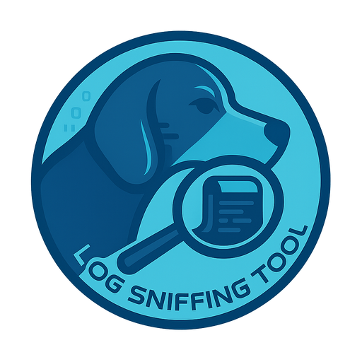

<p align="center">
  
</p>

<h1> Log Sniffing Tool</h1> 

A powerful, offline-friendly log inspection tool for developers, QA testers, and support engineers who need to work with large **JBoss log files** — whether they reside locally or on remote AWS servers.

This project is designed with usability and performance in mind: offering error detection, XML parsing, full-text search, and large file viewing through a beginner-friendly web interface.

---

## ✨ Features

### 📥 Seamless Log Download from AWS
- Connects via SCP to your AWS environment.
- Downloads logs into local `./logs` folder.
- Real-time download progress with ETA and abort button.
- Automatically extracts compressed `.zip`, `.tar.gz`, `.gz` files.

### 🧪 Smart Error Scanner
- Scans logs for `[FATAL]`, `[ERROR]`, and `[WARN]` entries.
- Displays where the error occurred, including:
  - Log file name
  - Line number
  - Thread ID
  - Service class
- Summary counters and color-coded error bars.

### 🧩 SOAP XML RQ/RS Parsing
- Detects and extracts all `XML Request:` and `XML Response:` payloads.
- Displays as a searchable table with:
  - Line number
  - Thread ID
  - Service class
  - Tag (with clickable viewer)
- Highlights entries containing issues with a warning icon (⚠️).
- Pretty-printed modal viewer with copy-to-clipboard.
- CSV export support.

### 🔍 Keyword Search Tool
- Scans all logs or targeted logs for specific keywords.
- Displays matching lines, context, and metadata.
- Real-time streamed progress + Abort option.
- Summary metrics: files scanned, matched, time elapsed.

### 📜 Raw Log Viewer
- Scroll through entire logs like in Notepad++.
- Line-number navigation, in-page search, previous/next match.
- "Go to line" and "Copy" options.
- Virtual scroll memory optimization for large files.

---

## 📁 Project Structure

```
logsniffingtool/
├── main.py                          # Backend logic (FastAPI)
├── scp_wrapper.sh                   # SCP wrapper for AWS download
├── scp_actual.pid                  # Runtime SCP tracking
├── applog/
│   └── fastAPI.log                  # Server logs
├── js/
│   ├── mainFrontEnd.js              # Error summary & XML
│   ├── searchToolFrontEnd.js        # Keyword search logic
│   └── viewrawlogs.js               # Raw log viewer
├── logs/
│   └── sample.log                   # Sample log for testing
├── static/
│   ├── style.css                    # Global styles
│   └── img/
│       ├── favicon.ico
│       ├── LogSniffingTool_60x60.png
│       ├── LogSniffingTool_512x512.png
│       └── LogSniffingTool_logo_1024x1024.png
├── templates/
│   └── index.html                   # Main tabbed interface
```

---

## ⚙️ Installation & Setup (for WSL Ubuntu)

### 🧱 Prerequisites
- Windows with WSL + Ubuntu installed
- Python 3.8+
- Basic familiarity with Linux terminal

### ✅ 1. Update System Packages
```bash
sudo apt update && sudo apt upgrade -y
```

### ✅ 2. Install Required Dependencies
```bash
sudo apt install -y python3 python3-pip python3-venv unzip curl openssh-client
```

### ✅ 3. Extract the Project
```bash
mkdir ~/logsniffingtool
cd ~/logsniffingtool
unzip /mnt/path/to/logsniffingtool.zip -d .
```

### ✅ 4. Create and Activate Python Virtual Environment
```bash
python3 -m venv venv
source venv/bin/activate
```

### ✅ 5. Install Python Dependencies
```bash
cat > requirements.txt <<EOF
fastapi
uvicorn
pydantic
aiofiles
jinja2
psutil
EOF

pip install -r requirements.txt
```

### ✅ 6. Make SCP Script Executable
```bash
chmod +x scp_wrapper.sh
```

### ✅ 7. Run the Tool
```bash
python3 -m uvicorn main:app --host 0.0.0.0 --port 8001 --reload
```
Then open in your browser:
```
http://localhost:8001
```

---

## 🧪 Sample Log Format
The tool expects JBoss-style logs, for example:
```
2025-07-01 12:00:01,234 [ThreadID] com.example.MyService [ERROR] Something bad happened
XML Request:
<soapenv:Envelope>...</soapenv:Envelope>
XML Response:
<soapenv:Envelope>...</soapenv:Envelope>
```

---

## 📚 User Guide

### 1. Download Logs
- Click **📥 Download Remote Logs**.
- Enter SCP details (hostname, username, file path).
- Wait for download to finish (real-time progress shown).

### 2. Analyze Logs
- Choose **All logs** or **Specific log** from the dropdown.
- Click **🧪 Review Logs** to begin analysis.
- View errors and filter by Thread or Service.

### 3. Browse SOAP XML
- Switch to the **Parsed XMLs** tab.
- Filter by Thread ID, Service, or RQ/RS tag.
- Click on any tag to view formatted XML.

### 4. Search Log Content
- Go to **Search Tools** tab.
- Enter keyword and select mode (All/Targeted).
- Click **🔍 Search** — results are streamed live.
- Click snippet row to view full context.

### 5. View Logs Like Text Editor
- Switch to **View Raw Logs** tab.
- Choose a file, click **📁 Load File**.
- Search, navigate, and copy directly like in Notepad++.

---

## ❓ FAQ

### Q: How do I update the log file list?
A: Click **🔄 Refresh List** in any tab to re-fetch log files.

### Q: What happens if SCP download fails?
A: A message will appear. Double-check SSH key, file path, or permissions.

### Q: Why do I see no XML in the SOAP tab?
A: Ensure the log contains `XML Request:` or `XML Response:` blocks.

### Q: Can I use this on Windows directly?
A: The tool is designed for WSL/Ubuntu. Native Windows support is not yet available.

### Q: Where do the logs go after SCP?
A: Extracted files are moved into the `./logs/` folder.

---

## 🛠️ Troubleshooting

| Issue                             | Solution                                                                 |
|----------------------------------|--------------------------------------------------------------------------|
| SCP not working                  | Ensure `scp` and `ssh` are installed: `sudo apt install openssh-client` |
| Port 8001 already in use         | Use a different port: `--port 8002`                                      |
| FastAPI not found                | Activate venv: `source venv/bin/activate`                                |
| XML viewer not loading           | Log may not have valid RQ/RS entries or JS error; try refresh            |
| Large logs crash the browser     | Use **View Raw Logs** tab for memory-optimized viewing                  |

---

## 🙌 Acknowledgments
This tool is designed for internal use and offline log analysis. Created to assist with:
- Fast debugging
- Issue reproduction
- SOAP service inspection

---

## 📌 Status
**Version**: `v1.0.0.BETA_RELEASE`

🛠️ Development ongoing. Core features are stable and working.
